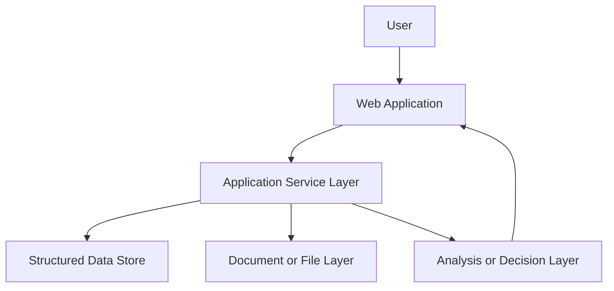

# Architecture

## High-level view

## Public-safe architecture notes
- user-facing interaction stays in the web application layer
- state and rules are handled server-side or in controlled services
- data persistence is separated from the interaction layer
- output is reviewed through product-specific workflow boundaries

## Private boundary
The repository does not publish route maps, deployment maps, provider wiring, storage layout, or implementation internals.
