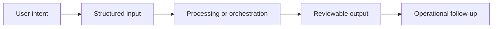

# Workflow

## Workflow summary
A signed event or operator action enters a domain layer, is normalized, routed into a governed task flow, executed by the right worker, and returned to product-facing workspaces with review and traceability.

## Public-safe boundary
This workflow is intentionally high level and does not expose internal decision rules or operating thresholds.
