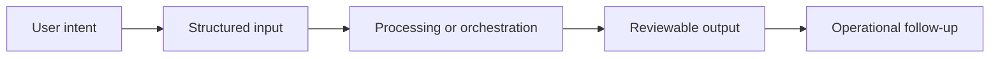

# Workflow

## Workflow summary
A user frames a scenario, the system structures the context, simulates multiple actors, tracks evolving signals, and returns an analytical output with scenario-oriented evidence.

## Public-safe boundary
This workflow is intentionally high level and does not expose internal decision rules or operating thresholds.
