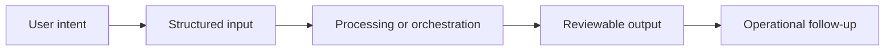

# Workflow

## Workflow summary
Documents are ingested and indexed, retrieval combines multiple evidence sources, and the user receives an answer paired with supporting evidence and processing status.

## Public-safe boundary
This workflow is intentionally high level and does not expose internal decision rules or operating thresholds.
