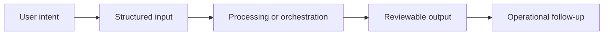

# Workflow

## Workflow summary
A user submits or types exam information, the system extracts structured content, applies deterministic calculations, and returns a clinical summary supported by controlled AI assistance.

## Public-safe boundary
This workflow is intentionally high level and does not expose internal decision rules or operating thresholds.
