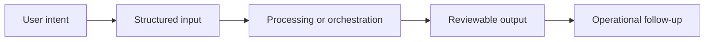

# Workflow

## Workflow summary
Operational data feeds dashboards, indicators are recorded and trended, action plans are tracked through PDCA cycles, and teams review progress in a single workspace.

## Public-safe boundary
This workflow is intentionally high level and does not expose internal decision rules or operating thresholds.
