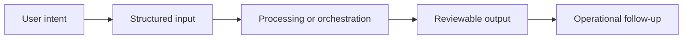

# Workflow

## Workflow summary
The workspace follows the deal phase, loads the right memory and evidence layer, asks blocking questions when needed, and helps the team produce reports, memos, and structured decision outputs.

## Public-safe boundary
This workflow is intentionally high level and does not expose internal decision rules or operating thresholds.
