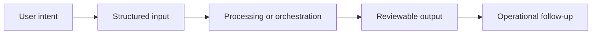

# Workflow

## Workflow summary
The user provides operational characteristics, the system scores exposure, estimates regulatory direction, and returns structured decision guidance in a public-safe high-level format.

## Public-safe boundary
This workflow is intentionally high level and does not expose internal decision rules or operating thresholds.
