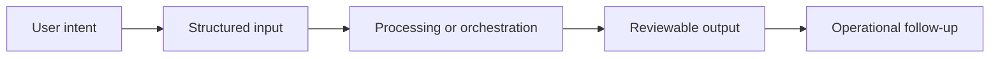

# Workflow

## Workflow summary
Users register items, score urgency-gravity-trend, and review the resulting ordering in a persistent workspace.

## Public-safe boundary
This workflow is intentionally high level and does not expose internal decision rules or operating thresholds.
