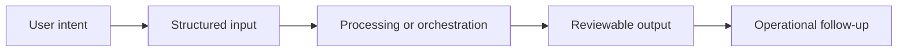

# Workflow

## Workflow summary
The user selects a template, fills guided fields, previews the result, and exports a diagram artifact in a stable visual format.

## Public-safe boundary
This workflow is intentionally high level and does not expose internal decision rules or operating thresholds.
