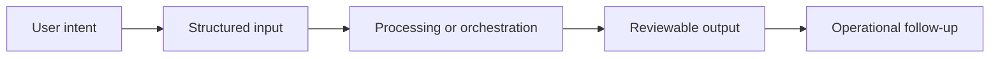

# Workflow

## Workflow summary
Teams manage dossiers, incoming documents, structured calculations, and guided knowledge workflows from a single operational surface.

## Public-safe boundary
This workflow is intentionally high level and does not expose internal decision rules or operating thresholds.
