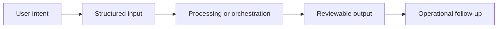

# Workflow

## Workflow summary
Users upload files, run open or guided analysis flows, and receive answers grounded in retrieved context from controlled knowledge sources.

## Public-safe boundary
This workflow is intentionally high level and does not expose internal decision rules or operating thresholds.
